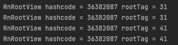

# Android project with ReactNative page

# 目的: 在现有 Android 项目中引入 RN 开发的页面

## Environment
- gradle 7.4
- kotlin 1.7.20
- Android Studio Dolphin

---
2023-03-10
## RN 环境配置
RN 环境初始化，首个 RN 项目

建议按照 [官方文档](https://reactnative.dev/docs/environment-setup) 配置, 一定要足够细心+耐心

配置完毕,可以得到一个可运行的工程 [这是我的 RN Demo](https://github.com/HeCaser/RNProjectForAndroid)

---
2023-03-11
## 现有 Android 项目接入 RN

- 官网：https://reactnative.dev/docs/integration-with-existing-apps

- 细节可参考上面的 Demo


### 1. 新建一个文件夹 RNIntegration , 然后新建一个名为 android 的目录, 把现有 Android 项目放在 android 目录中

### 2. 添加 JS 依赖: 在 RNIntegration 目录下新建 `package.json` 文件, 内容如下

```
    {
      "name": "RNProjectForAndroid",
      "version": "0.0.1",
      "private": true,
      "scripts": {
        "start": "react-native start"
      }
    }
```

 在 RNIntegration 目录下执行 `yarn add react-native` 会生成 node_modules 文件夹,里面包含构建工程的所有依赖, 添加进 .gitignore


### 3. Adding React Native to your app

#### 3.1 Configuring Gradle

 settings.gradle 文件修改

```
includeBuild('../node_modules/react-native-gradle-plugin')
```


2023-03-29

build.gradle 文件修改
> commit 9c4ff90d40fd1100595994f95893fcb800394c25.

>  其中 com.facebook.react 与 gradle 设置有冲突, Demo 中做了调整,保证集成 RN 顺利进行


Enable native modules autolinking

App 权限配置

#### 3.2 Code integration

JS 文件
>commit: 05c6dc6ebc8e3abd6fe155d9c87cce79aa6357c2

Android 文件
>commit: b95a472eab0b1076b04ce80dab4dbef7c164e6f6


### Test your integration

- 启动 metro : `yarn start`
- Run App

### 成功 load JS 页面


---
2023-04-03
## 构建 Release 包

### 依赖 react-native-gradle-plugin  + AS  构建
> 如果 Android Studio 依赖了 react-native-gradle-plugin 以及相关插件 'com.facebook.react' 那么可以直接构建 Release App. (被项目未实现)

### 命令行打包 bundle 构建
> 本地 Bundle 适用于 Debug Release 等环境

- 执行下面命令生成 Bundle 包放置在 assets 目录下(注意替换自己的路径)
$ npx react-native bundle --platform android --dev false --entry-file index.js --bundle-output android/app/src/main/assets/index.android.bundle --assets-dest android/app/src/main/res/

- 构建 Release App 

---

2023-04-04
## 集成 RN Fragment
commits: 9664510e0b0a5c05a236d4960664e1c56a468153 0fe1b5bc958558f34706e8b6a7495d8d994456b1

---

2023-04-26 
## Native JS 通信: 移动端传递数据到 JS 
> native 发送 event 与 data 给 JS 侧. 以 Android 为例

### Android 侧
> 通过 `ReactInstanceManager` 获取 `DeviceEventManagerModule` 然后发送事件

```
   manager?.currentReactContext
   ?.getJSModule(DeviceEventManagerModule.RCTDeviceEventEmitter::class.java)
   ?.emit(eventName, eventData) 
```
问题: ReactInstanceManager 的 currentReactContext 是异步创建的, 使用时可能为空
解决: 通过回调监听 Context 的创建解决, 详情查看 `com.panhe.rnandroid.util.RNCommonUtil#sendEventToJs`

### JS 侧
>调用 React 提供的方法即可 

```
import {
  NativeEventEmitter,
} from 'react-native';

DeviceEventEmitter.addListener(eventName,(data: string) => {
    console.log('hepan Rn 侧接收到回调 ' + data)
    setParam(data)
 })
```

---

2023-07-21

# 加载 assets 目录下的 bundle 包, 页面渲染很慢

原因是构建 RN 管理器时, 默认 debug 模式为 true, 本应通过 metro 调试, 但是本地 metro 服务停止时, 管理器会尝试加载 assets 中的 bundle 包, 但是速度会异常缓慢.

解决办法: debug 模式改为 false

```
// 当直接加载 bundle 文件时
setUseDeveloperSupport(false)
```

---

2023-08-15

# `RecyclerView` 加载 `RN` Item

## 技术方案

利用 `ReactRootView` 直接加载 RN 组件, 然后 `ReactRootView` 作为 `RecyclerView` 的 Item 来展示.

ReactRootView 加载 RN 代码:

```
 reactRootView.startReactApplication(manager, ConstUtil.RNTestItem)
```

## 直接复用崩溃

问题描述: 复用时,同一个 `ReactRootView` 在第二次调用 `startReactApplication` 会抛出异常

解决办法1: 反射置为空
> 只是避免了报错, 重新 `startReactApplication()` 是无效的
> 
```
  private fun setManager2Null(view: ReactRootView) {
            val field = view.javaClass.getDeclaredField("mReactInstanceManager")
            field.isAccessible = true
            field.set(view, null)
        }
```

解决办法2: 卸载 view 后重新加载

```
reactRootView.unmountReactApplication()
reactRootView.startReactApplication()()
```

## 最终复用方案

上面的方法2: **卸载 view 后重新加载** 虽然可以实现不同类型的 RN 页面复用,但是会产生验证的性能消耗,以及滑动卡顿, 甚至崩溃问题

优化后的复用方案如下:

- 所有 RN 条目对应一种 `RecyclerView.Adapter` 中的 `ItemViewType` 

- ViewHolder 只是一个 View 壳子, 里面填充 `ReactRootView`
  
- 相同类型的 RN 条目(AppRegistry.registerComponent 注册名相同), 可以复用 `ReactRootView`, 不同的 RN 条目不可复用

- `ReactRootView` 展示的正确性(复用导致展示异常) 在 `onBindViewHolder` 中通过 `reactRootView.setAppProperties()` 设置当前 Item 状态, RN 依据 props 属性刷新

具体实现:

回收 ReactRootView

``` 
 override fun onViewRecycled(holder: MyViewHolder) {
        super.onViewRecycled(holder)
        pool.putReactRootView(holder.mReactRootView)
        println("hepan 回收了 ${holder.mReactRootView?.jsModuleName}")

    }
```

复用 

```
// RnItemAdapter
 override fun onBindViewHolder(holder: MyViewHolder, position: Int) {
        val bean = dataList[position]
        holder.loadOrUpdateView(bean)
    }
```

方案变种:

在上面的回收方案中, `pool.putReactRootView(holder.mReactRootView)` 缓存的 View 不能给其他的 Holder 使用, 只能给当前 Holer 继续使用, 因为其 mReactRootView.parent 不等于 null. 因此方案变种可以改为

1. 在回收时,直接释放 mReactRootView (从父类移除)
2. 在 Holder 中, 每次触发 onBindViewHolder 时只有一个原生 View 作为壳子,优先取缓存池的 ReactRootView, 没有同类型的话则创建一个 ReactRootView

代码类似:

回收时

```
  holder.mReactRootView.removeAllViews()
  pool.putReactRootView(holder.mReactRootView)
```

复用时

```
  rnView = reactRootViewPool.getReactRootView(bean.module)
  if (rnView == null) {
      rnView = generateReactRootView(context, bean, rnManager)
      showRnView(containerView, rnView)
      tvInfo.text = "${bean.module} 没有缓存 , 创建 ReactRootView "
  } else {
      showRnView(containerView, rnView)
      refresh(rnView, data)
      tvInfo.text = "${bean.module} 从缓存池获取, 需刷新 Item"
  }
```

----

2023-08-31 

# 验证 setAppProperties 是否导致 RN 组件重建

继续上面的复用逻辑, 有同事反馈在调用 `setAppProperties(@Nullable Bundle appProperties) ` 时. 整个 RN 组件会重新渲染,从而导致触发了不必要的网络请求.

实测在 Native 侧调用 `setAppProperties`

```
 private fun testFund() {
      mReactRootView?.apply {
          var prop = appProperties
          if (prop == null) {
              prop = Bundle()
          }
          val msg = if (Random.nextBoolean()) "1" else "2"
          prop.putString("native_data_string", msg)
          appProperties = prop
      }
  }
```

RN 根据 props 控制 View 展示

```
{props.native_data_string === '1' &&  <Text>从移动端获取的数据是1 {props.native_data}</Text>}
{props.native_data_string !=="1" &&  <Text>从移动端获取的数据不是1 {props.native_data}</Text>}
```

结论: 并未触发 RN 组件的刷新

---

2023-08-31 

# RootRag 变动

问题描述: `ReactRootView` 加载 JS 后, `mRootViewTag` 成员变量会被赋值, 但其值会变动



因此需要 mRootViewTag 的地方, 要直接在 `ReactRootView` 对象中获取

```
prop.putString("rootTag", "${mReactRootView?.rootViewTag}")
```

## RN 获取当前组件的 RootTag (版本 >= 0.66)

```
import {RootTagContext} from 'react-native';

function ScreenA() {
  const rootTag = useContext(RootTagContext);

  ...
}

